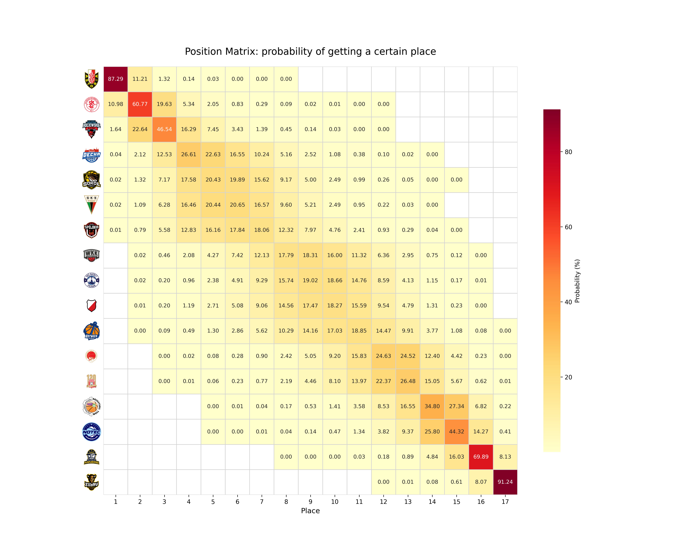
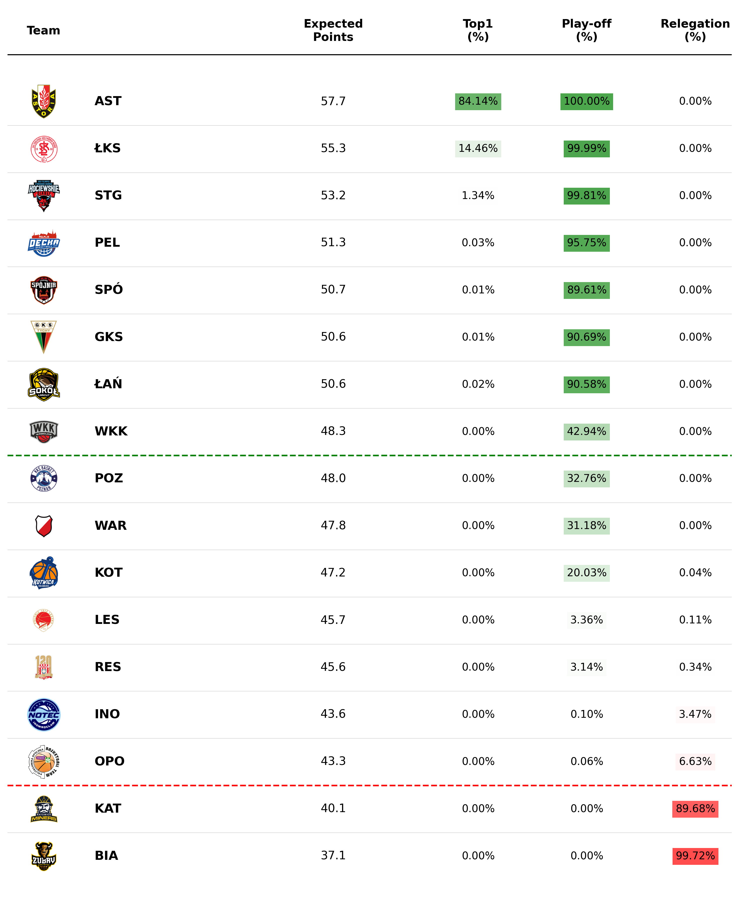

# 🏀 Basketball League Predictor: Elo & Monte Carlo Simulation


An advanced, end-to-end Data Science pipeline designed to predict the final standings, playoff probabilities, and relegation risks for a basketball league. It uses a custom **Elo Rating System** combined with a **Monte Carlo Engine** running 1,000,000 simulations to forecast the future of the season.

---

## 📊 Latest Simulation Results

*These visualizations are generated automatically based on the most recent match data.*

### 🎯 Position Probability Matrix
Shows the exact percentage chance of each team finishing in a specific league position. The more red a square is, the higher the probability.
<p align="center">
  
</p>

### 📈 Projected Standings & Probabilities
Simulation table with team logos and chances for playoffs, relegation, and winning the league.
<p align="center">
  
</p>

---

## 📌 Features

- Elo rating system with home court advantage
- 1,000,000 Monte Carlo season simulations
- Playoff, championship and relegation probabilities
- Automatic visualization pipeline
- Easy adaptation to other leagues

---

## ⚙️ How It Works (The Pipeline)

This project is built on a robust, 4-step pipeline:

1. **Data Collection (Web Scraping / Data Ingestion):**
   Fetches the latest match results, current standings, and the schedule of remaining games.
2. **Elo Rating Engine:**
   Calculates the dynamic strength of each team based on historical results. It accounts for **Home Court Advantage (HCA)** and uses a specific **K-factor** optimized for basketball to react to sudden drops or spikes in form.
3. **Monte Carlo Simulation:**
   Takes the current standings, the remaining schedule, and the teams' Elo ratings to simulate the rest of the season **1,000,000 times**. It resolves tie-breakers, calculates Expected Points (xPts), and aggregates the probabilities for:
   - Winning the regular season
   - Reaching the Playoffs
   - Facing Relegation
4. **Data Visualization:**
   Transforms raw simulation data into professional, easy-to-read graphical reports using `matplotlib` and `seaborn`.

---

## 🗂️ Project Structure

```text
basketball-predictor/
│
├── data/                       # Downloaded data and raw simulation results
│   ├── logos/                  # Team logos used in visualizations (.png)
│   ├── matches_future.csv      # Schedule of upcoming matches
│   ├── matches_played.csv      # Results of past matches
│   ├── simulation_results.csv  # Raw results from the Monte Carlo engine
│   └── table.csv               # Current league standings
│
├── src/                        # Project source code
│   ├── __pycache__/            # Compiled Python files
│   ├── __init__.py             # Module initialization
│   ├── elo.py                  # Elo rating mathematical model
│   ├── scraper.py              # Web scraping and data parsing script
│   ├── simulation.py           # Monte Carlo 1m simulation logic
│   └── visuals.py              # Scripts generating charts and tables
│
├── visualisations/             # Generated graphical outputs
│   ├── position_matrix.png     # Heatmap of finishing probabilities
│   └── visual_table.png        # Simulation table with team logos
│
├── .gitignore                  # Files ignored by Git
├── LICENSE                     # Project license
├── main.py                     # Main orchestrator script
└── README.md                   # Project documentation
```

## 🚀 Quick Start

Want to run the simulation yourself or adapt it to another league?

### 1. Clone the repository

```bash
git clone https://github.com/Kajtek47/basketball-predictor.git
cd basketball-predictor
```

### 2. Install dependencies

```bash
pip install pandas numpy matplotlib seaborn
```

### 3. Run the full pipeline

```bash
python main.py
```

Sit back and wait a few seconds while the CPU simulates millions of possible seasons. 

### 4. Check the results

Navigate to the `visualisations/` folder to see the generated charts and the `data/` folder for raw `.csv` output.